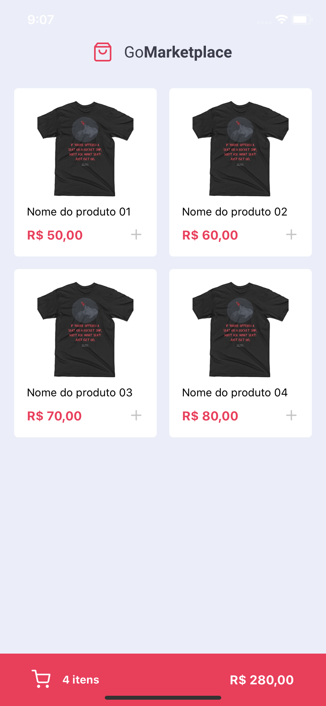

[![Contributors][contributors-shield]][contributors-url]
[![Forks][forks-shield]][forks-url]
[![Stargazers][stars-shield]][stars-url]
[![Issues][issues-shield]][issues-url]
[![MIT License][license-shield]][license-url]
[![LinkedIn][linkedin-shield]][linkedin-url]

<!-- PROJECT LOGO -->
<br />
<p align="center">
  <a href="https://github.com/guilhermedeandrade/gostack-react-native-fundamentals">
    
  </a>

  <h3 align="center">GoMarketplace</h3>

  <p align="center">
    This was the 8th challenge of the GoStack 11 bootcamp, which is a marketplace app built with React Native, TypeScript and styled-components.
    <br />
    <a href="https://github.com/guilhermedeandrade/gostack-react-native-fundamentals"><strong>Explore the docs »</strong></a>
    <br />
    <br />
    <a href="https://github.com/guilhermedeandrade/gostack-react-native-fundamentals">View Demo</a>
    ·
    <a href="https://github.com/guilhermedeandrade/gostack-react-native-fundamentals/issues">Report Bug</a>
    ·
    <a href="https://github.com/guilhermedeandrade/gostack-react-native-fundamentals/issues">Request Feature</a>
  </p>
</p>

<!-- TABLE OF CONTENTS -->

## Table of Contents

- [About the Project](#about-the-project)
  - [Built With](#built-with)
- [Getting Started](#getting-started)
  - [Prerequisites](#prerequisites)
  - [Installation](#installation)
- [License](#license)
- [Contact](#contact)

<!-- ABOUT THE PROJECT -->

## About The Project

<p align="center">
  
</p>

This is the GoStack 11 bootcamp 8th challenge, which is a marketplace app built with React Native, TypeScript and styled-components.

### Built With

- [React Native](https://reactnative.dev/)
- [TypeScript](https://www.typescriptlang.org/)
- [styled-components](https://styled-components.com/)

<!-- GETTING STARTED -->

## Getting Started

To get a local copy up and running follow these simple steps.

### Prerequisites

This is an example of how to list things you need to use the software and how to install them.

- npm

```sh
npm install npm@latest -g
```

- CocoaPods

```sh
sudo gem install cocoapods
```

### Installation

1. Clone the repo and enter the project folder

```sh
git clone https://github.com/guilhermedeandrade/gostack-react-native-fundamentals.git
cd gostack-react-native-fundamentals
```

2. Install NPM packages

```sh
npm install
```

3. Install CocoaPods dependencies

```sh
cd ios
pod install
```

4. Run the server

```sh
npx json-server --watch server.json --port 3333
```

5. Run the app

```sh
npm run ios
```

<!-- LICENSE -->

## License

Distributed under the MIT License. See `LICENSE` for more information.

<!-- CONTACT -->

## Contact

Guilherme de Andrade - [@ubmit](https://twitter.com/ubmit) - guilhermedeandrade@protonmail.com

Project Link: [https://github.com/guilhermedeandrade/gostack-react-native-fundamentals](https://github.com/guilhermedeandrade/gostack-react-native-fundamentals)

[contributors-shield]: https://img.shields.io/github/contributors/guilhermedeandrade/gostack-react-native-fundamentals.svg?style=flat-square
[contributors-url]: https://github.com/guilhermedeandrade/gostack-react-native-fundamentals/graphs/contributors
[forks-shield]: https://img.shields.io/github/forks/guilhermedeandrade/gostack-react-native-fundamentals.svg?style=flat-square
[forks-url]: https://github.com/guilhermedeandrade/gostack-react-native-fundamentals/network/members
[stars-shield]: https://img.shields.io/github/stars/guilhermedeandrade/gostack-react-native-fundamentals.svg?style=flat-square
[stars-url]: https://github.com/guilhermedeandrade/gostack-react-native-fundamentals/stargazers
[issues-shield]: https://img.shields.io/github/issues/guilhermedeandrade/gostack-react-native-fundamentals.svg?style=flat-square
[issues-url]: https://github.com/guilhermedeandrade/gostack-react-native-fundamentals/issues
[license-shield]: https://img.shields.io/github/license/guilhermedeandrade/gostack-react-native-fundamentals.svg?style=flat-square
[license-url]: https://github.com/guilhermedeandrade/gostack-react-native-fundamentals/blob/master/LICENSE
[linkedin-shield]: https://img.shields.io/badge/-LinkedIn-black.svg?style=flat-square&logo=linkedin&colorB=555
[linkedin-url]: https://linkedin.com/in/andradedeguilherme
